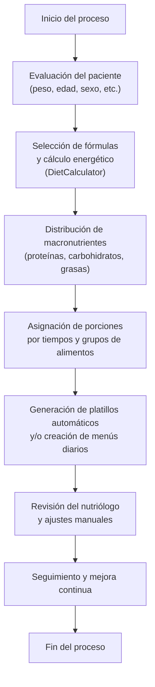

# flujo lógico y técnico

Documentación de nutriólogos.

---

# 🧠 Flujo de generación de dieta automática

Este documento describe el proceso general para generar una dieta dentro del ecosistema **Multinature**, desde la evaluación inicial del paciente hasta la generación automatizada de platillos y menús diarios.  
El flujo combina cálculos nutricionales basados en fórmulas científicas, decisiones del especialista y automatización a través de los agentes del sistema.

---

## 🔹 Etapas del proceso

### 1. Evaluación del paciente

El proceso inicia con la recopilación de información relevante:

- **Datos antropométricos:** peso, talla, edad, sexo, IMC, grasa corporal.
- **Datos clínicos:** diagnósticos, historial médico, medicamentos, síntomas.
- **Datos de estilo de vida:** nivel de actividad física, hábitos alimenticios, objetivos.

> Esta información se registra previemente en el sistema (en las tablas [filled_form_values](../../../01_Backend/Database/Tables/filled_form_values.md) y [filled_forms](../../../01_Backend/Database/Tables/filled_forms.md)) y queda asociada al `user_id` del paciente.

---

### 2. Selección de fórmulas y cálculo energético (DietoCálculo)

El sistema o el especialista eligen una o varias fórmulas de cálculo:

- **Ejemplos:** Harris-Benedict, Mifflin-St Jeor, Cunningham, IOM, FAO/OMS.
- Se calcula el **Gasto Energético Basal (GEB)** y luego el **Gasto Energético Total (GET)** aplicando factores de actividad y estrés.

**Output esperado:**

```json
"calorieCalculations": {
  "source": "DietCalculator",
  "formulaResults": [
    {
      "step": "Harris Benedict",
      "value": 2214.5
    },
    {
      "step": "Mifflin-St Jeor",
      "value": 2042.73
    },
    {
      "step": "Owen General",
      "value": 1883.15
    },
    {
      "step": "Promedio basal",
      "value": 2046.79
    },
    {
      "step": "ETA (termogenesis)",
      "value": 204.68
    },
    {
      "step": "AF (actividad)",
      "value": 0
    },
    {
      "step": "Ajuste por deficit objetivo",
      "value": -337.72
    }
  ],
  "calculatedGET": 2251.47,
  "averageCalories": 2046.79,
  "AFCalories": 0,
  "ETACalories": 204.68
},
```

#### 2.1 Asignación de nuevo Gasto Energético Total (GET)

El sistema o el especialista eligen un nuevo Gasto Energético Total (GET) a partir del objetivo, las condiciones del paciente y el Gasto Energético Total (GET) previamente cálculado

**Output esperado:**

```json
"recommendedGET": {
  "value": 1913.75,
  "source": "DietCalculator",
  "rationale": "GET calculado mediante Harris Benedict y Mifflin-St Jeor para paciente de 25 anos, 102 kg, 183 cm (IMC 30.46), sexo Hombre y factor de actividad 1.00, con ajuste de -15% por objetivo \"Quiero bajar de peso\" según protocolo SMAE, resultando",
  "justification": "GET calculado mediante Harris Benedict y Mifflin-St Jeor para paciente de 25 anos, 102 kg, 183 cm (IMC 30.46), sexo Hombre y factor de actividad 1.00, con ajuste de -15% por objetivo \"Quiero bajar de peso\" según protocolo SMAE, resultando"
},
```

---

### 3. Distribución de macronutrientes

- El sistema o el especialista definen los porcentajes o gramos diarios de: **Proteínas**, **Carbohidratos** y **Grasas**.
- El objetivo es equilibrar las calorías totales y alinearlas con el propósito del plan (déficit, mantenimiento o superávit).

**Output esperado:**

```json
"macronutrients": {
  "proteinsPerDay": 143.53,
  "lipidsPerDay": 63.79,
  "carbohydratesPerDay": 191.38,
  "justification": "Distribucion 30% proteina (~143.53 g), 30% grasa (~63.79 g) y 40% carbohidratos (~191.38 g) alineada a SMAE y meta deficit moderado (-15%)."
},
```

---

### 4. Asignación por horarios y grupos de alimentos

El especialista o el agente distribuyen los macronutrientes entre los diferentes tiempos de comida (ej. desayuno, comida, cena, colaciones).
Cada horario se define por porciones equivalentes usando los grupos alimenticios del sistema:

| Tiempo   | Frutas | Cereales | Verduras | Lácteos | Proteínas | Grasas |
| -------- | ------ | -------- | -------- | ------- | --------- | ------ |
| Desayuno | 3      | 6        | 5        | 1       | 2         | 1      |
| Comida   | 2      | 5        | 6        | 0       | 4         | 2      |

Este paso convierte la distribución de macronutrientes en porciones de equivalentes, usando la base de datos de equivalencias del sistema.

---

### 5. Generación de platillos

El agente selecciona automáticamente alimentos o recetas dentro de cada grupo, respetando las porciones asignadas.

**Ejemplo:**

- Desayuno → 2 frutas (manzana, plátano), 1 lácteo (leche light), 2 cereales (pan integral), 1 grasa (mantequilla de maní).

- Comida → arroz, pollo a la plancha, verduras mixtas, aguacate.

**Output final:** un conjunto de menús o planes diarios (menus) organizados por tiempos de comida (meals).

**Output esperado:**

```json
"meals": [
  {
    "menuMealId": "8b4f457e-32a3-4ef9-9187-80e348c26d00",
    "mealTime": "07:30:00.000000",
    "mealType": "desayuno",
    "dishes": [
      {
        "id": "acfa0cb4-5e2b-4230-ad3c-4cfca5e870a3",
        "name": "Panqué de Naranja",
        "type": "food",
        "foodId": "7bf18f47-84da-4512-991f-54ff672602a6",
        "ingredientId": null,
        "option": 0,
        "quantity": 2,
        "computed": null,
        "ingredients": [
          {
            "ingredientId": "d549dfea-6661-11f0-8618-1290daed9e2f",
            "ingredientName": "Mantequilla sin sal",
            "unit": "cdita",
            "foodIngredientQty": 7,
            "menuItemQty": 2,
            "newQuantityUnits": 14,
            "totalGrams": 154,
            "displayQuantity": "14.000 cdita"
          },
          {
            "ingredientId": "b1dd74d5-8e68-11f0-8618-1290daed9e2f",
            "ingredientName": "Azúcar de mesa",
            "unit": "cdita",
            "foodIngredientQty": 4,
            "menuItemQty": 2,
            "newQuantityUnits": 8,
            "totalGrams": 34,
            "displayQuantity": "8.000 cdita"
          },
          {
            "ingredientId": "58cbba25-6665-11f0-8618-1290daed9e2f",
            "ingredientName": "Harina",
            "unit": "cda",
            "foodIngredientQty": 3.75,
            "menuItemQty": 2,
            "newQuantityUnits": 7.5,
            "totalGrams": 67.5,
            "displayQuantity": "7.500 cda"
          },
          {
            "ingredientId": "b320733f-8e68-11f0-8618-1290daed9e2f",
            "ingredientName": "Azúcar glass",
            "unit": "cdita",
            "foodIngredientQty": 1.2,
            "menuItemQty": 2,
            "newQuantityUnits": 2.4,
            "totalGrams": 10.2,
            "displayQuantity": "2.400 cdita"
          },
          {
            "ingredientId": "04adcf22-6663-11f0-8618-1290daed9e2f",
            "ingredientName": "Naranja",
            "unit": "pieza",
            "foodIngredientQty": 0.33,
            "menuItemQty": 2,
            "newQuantityUnits": 0.66,
            "totalGrams": 99,
            "displayQuantity": "0.660 pieza"
          },
          {
            "ingredientId": "ce3184e6-6740-11f0-8618-1290daed9e2f",
            "ingredientName": "Huevo fresco",
            "unit": "pieza",
            "foodIngredientQty": 0.3,
            "menuItemQty": 2,
            "newQuantityUnits": 0.6,
            "totalGrams": 30,
            "displayQuantity": "0.600 pieza"
          },
          {
            "ingredientId": "79a17d53-665f-11f0-8618-1290daed9e2f",
            "ingredientName": "Leche",
            "unit": "taza",
            "foodIngredientQty": 0.12,
            "menuItemQty": 2,
            "newQuantityUnits": 0.24,
            "totalGrams": 59.33,
            "displayQuantity": "0.240 taza"
          },
          {
            "ingredientId": "1ff2766e-665c-11f0-8618-1290daed9e2f",
            "ingredientName": "Sal",
            "unit": "cdita",
            "foodIngredientQty": 0.1,
            "menuItemQty": 2,
            "newQuantityUnits": 0.2,
            "totalGrams": 2.2,
            "displayQuantity": "0.200 cdita"
          },
          {
            "ingredientId": "40845a7f-665c-11f0-8618-1290daed9e2f",
            "ingredientName": "Vainilla",
            "unit": "cdita",
            "foodIngredientQty": 0.01,
            "menuItemQty": 2,
            "newQuantityUnits": 0.02,
            "totalGrams": 1,
            "displayQuantity": "0.020 cdita"
          }
        ],
        "ingredientsTotalGrams": 457.23,
        "recipe": "1.  Precalentar el horno.2.  Engrasar con mantequilla los moldes.3.  Rallar la cáscara de la naranja.4.  Cernir la harina con la sal y el royal.5.  Batir la mantequilla con el azúcar hasta acremar.6.  Añadir los huevos uno por uno sin dejar de batir. 7.  Añadir la ralladura de naranja.8.  Añadir la harina cernida, alternar con la leche. No dejar de batir.9.  Verter la masa en el molde engrasado y hornear.10.  Desmoldar, dejar enfriar, espolvorear con azúcar. 11.  Cortar en cuadros.",
        "energyKcal": 903.34,
        "proteinGrams": 12.34,
        "carbohydratesGrams": 94.26,
        "lipidsGrams": 54.34,
        "dishType": "main"
      }
    ],
    "equivalences": [
      {
        "name": "AOA - Bajo en grasa",
        "quantity": 2
      },
      {
        "name": "Leche - Descremada",
        "quantity": 1
      },
      {
        "name": "Cereal - Sin grasa",
        "quantity": 2
      },
      {
        "name": "Fruta",
        "quantity": 1
      },
      {
        "name": "Verdura",
        "quantity": 1
      },
      {
        "name": "Grasa - Sin proteina",
        "quantity": 2
      },
      {
        "name": "Libre",
        "quantity": 1
      }
    ],
    "macros": {
      "energyKcal": 903.34,
      "proteinGrams": 12.34,
      "carbohydratesGrams": 94.26,
      "lipidsGrams": 54.34
    },
    "justification": "Panqué de Naranja inicia el día con 903 kcal y 12g de proteína, activando el metabolismo. El aporte energético considerable favorece saciedad matutina."
  },
```

---

### 6. Seguimiento y ajuste (opcional)

El sistema puede registrar la adherencia del paciente, retroalimentación del nutriólogo o sugerencias del agente para ajustes posteriores.

🧭 Diagrama del flujo



---

## 🧩 Endpoints de Dietas — Orquestador sin persistencia (schema actual)

> El **POST /diets/{dietId}/actions** **no guarda** en la BD; solo orquesta y devuelve el render completo en el **mismo formato** que ya estamos consumiendo. El **GET /diets/generate-automatic/:userId** se mantiene igual.

---

## 1) Forma de la respuesta (envelope + objeto de dieta)

La API **siempre** responde con este envoltorio y con el objeto de dieta dentro de `content.content[0]`:

```json
{
  "folio": "uuid-v4",
  "message": "Automatic diet generated successfully by DietAgent",
  "content": {
    "content": [
      {
        "dietId": "",
        "specialistId": "…",
        "notes": "",
        "patientObjective": "…",
        "mealStructure": {
          "days": 7,
          "mealsPerDay": ["Desayuno", "Comida", "Cena", "Colacion"],
          "justifications": { "daysJustification": "…", "mealsJustification": "…" }
        },
        "recommendedGET": { "value": 1913.75, "source": "DietCalculator", "rationale": "…", "justification": "…" },
        "macronutrients": {
          "proteinsPerDay": 143.53,
          "lipidsPerDay": 63.79,
          "carbohydratesPerDay": 191.38,
          "justification": "…"
        },
        "calorieCalculations": {
          "source": "DietCalculator",
          "formulaResults": [
            { "step": "Harris Benedict", "value": 2214.5 },
            { "step": "Mifflin-St Jeor", "value": 2042.73 },
            { "step": "Owen General", "value": 1883.15 },
            { "step": "Promedio basal", "value": 2046.79 },
            { "step": "ETA (termogenesis)", "value": 204.68 },
            { "step": "AF (actividad)", "value": 0 },
            { "step": "Ajuste por deficit objetivo", "value": -337.72 }
          ],
          "calculatedGET": 2251.47,
          "averageCalories": 2046.79,
          "AFCalories": 0,
          "ETACalories": 204.68
        },
        "menus": [
          {
            "assignedDays": [0],
            "meals": [
              {
                "mealType": "desayuno",
                "mealTime": "07:30:00.000000",
                "equivalences": [
                  { "name": "AOA - Bajo en grasa", "quantity": 2 },
                  { "name": "Leche - Descremada", "quantity": 1 }
                ],
                "dishes": [
                  {
                    "name": "Panqué de Naranja",
                    "ingredients": [
                      { "ingredientName": "Mantequilla sin sal", "displayQuantity": "14.000 cdita", "totalGrams": 154 }
                    ],
                    "energyKcal": 903.34,
                    "proteinGrams": 12.34,
                    "carbohydratesGrams": 94.26,
                    "lipidsGrams": 54.34
                  }
                ],
                "macros": {
                  "energyKcal": 903.34,
                  "proteinGrams": 12.34,
                  "carbohydratesGrams": 94.26,
                  "lipidsGrams": 54.34
                },
                "justification": "…"
              }
            ]
          }
        ]
      }
    ]
  }
}
```

**Claves importantes para Frontend:**

- `equivalences` llega **con nombres ya normalizados** (`"name": "Grupo - Subgrupo"`).
- Cada `dish` trae lista de `ingredients` con `displayQuantity` y `totalGrams`.
- `calorieCalculations.formulaResults[*].step` usa etiquetas tipo `"Harris Benedict"`, `"Mifflin-St Jeor"`, etc.

---

## 2) Endpoints

| Funcionalidad                           | Endpoint                            | Método   | Descripción                                                                                             |
| --------------------------------------- | ----------------------------------- | -------- | ------------------------------------------------------------------------------------------------------- |
| Orquestar tramo del flujo (sin guardar) | `/diets/{dietId}/actions`           | **POST** | Recibe `{ action, startFrom, until, overrides }`. Devuelve **render completo** en el **schema actual**. |
| Generar base automática                 | `/diets/generate-automatic/:userId` | **GET**  | Bootstrap a partir del último form del usuario. Devuelve el render inicial en el **schema actual**.     |

---

## 3) Ejemplos por tramo (request mínimos)

> Todas las respuestas mantienen la forma descrita en la sección 1.

### A) dietocalculo → equivalences

```json
{
  "overrides": {
    "dietocalculo": {
      "formulas": ["mifflinStJeor", "IOM"],
      "params": { "CAF": 1.4, "ETA": 10, "AF": 0 }
    },
    "schedule": {
      "days": [0, 1, 2, 3, 4, 5, 6],
      "mealsPerDay": [
        { "mealType": "desayuno", "time": "07:00" },
        { "mealType": "colacion", "time": "10:30" },
        { "mealType": "comida", "time": "13:30" },
        { "mealType": "cena", "time": "19:30" }
      ]
    }
  },
  "action": "run_agent",
  "startFrom": "dietocalculo",
  "until": "equivalences"
}
```

### B) Solo macros (grams)

```json
{
  "overrides": { "macronutrients": { "mode": "grams", "proteins": 150, "carbohydrates": 200, "lipids": 60 } },
  "action": "run_agent",
  "startFrom": "macros",
  "until": "macros"
}
```

### C) Schedule + equivalences (un meal)

```json
{
  "overrides": {
    "schedule": { "days": [0], "mealsPerDay": [{ "mealType": "desayuno", "time": "07:15" }] },
    "equivalences": {
      "byMeal": [
        {
          "day": 0,
          "mealType": "desayuno",
          "items": [
            { "equivalencesGroupId": "EG_Cereales", "quantity": 2 },
            { "equivalencesGroupId": "EG_LPD", "quantity": 1 }
          ]
        }
      ]
    }
  },
  "action": "run_agent",
  "startFrom": "schedule",
  "until": "equivalences"
}
```

### D) expand_dishes (auto)

```json
{
  "overrides": { "dishes": { "mode": "auto", "constraints": { "maxPrepTimeMins": 15 } } },
  "action": "expand_dishes",
  "startFrom": "dishes",
  "until": "dishes"
}
```

---

## 4) Consideraciones

- Si no envías algún override, el backend usa datos del **último form** del usuario (peso, talla, sexo, edad, objetivo, CAF/ETA/AF, etc.).
- **No hay persistencia** desde estos endpoints; son para **previsualizar** y ajustar.
- Nombres de equivalencias ya vienen resueltos a texto.

---

- **Última actualización:** 2025-10-31
