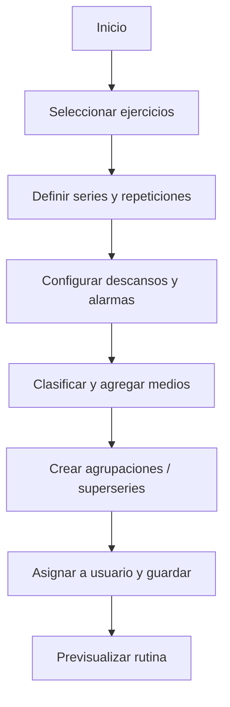
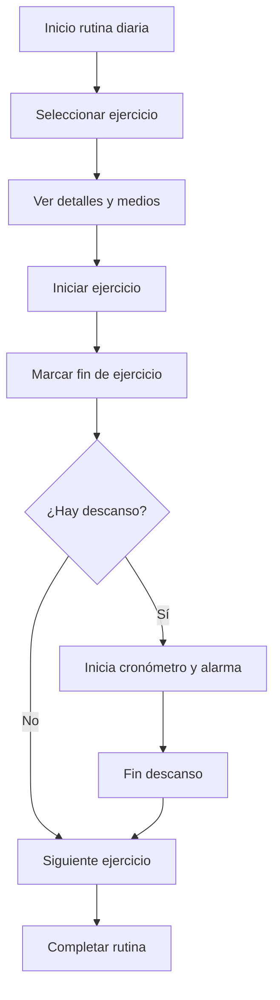

# Multinature — Flujos de Rutinas (Instrucciones para Pandalatec)

Este documento describe los requisitos de **UI/UX** y la lógica de interacción para el desarrollo del flujo de **creación de rutinas por especialistas** y **ejecución de rutinas por usuarios** en la app móvil de **Multinature**.

---

## 📌 Contexto

Multinature es una plataforma para especialistas en nutrición y entrenamiento.  
La app móvil permitirá a los usuarios seguir sus rutinas diarias, registrar su progreso y visualizar materiales de apoyo (imágenes, videos o GIFs).

Este documento se centra en la experiencia del usuario final y en los flujos que **Pandalatec** debe maquetar e implementar.

---

## 🧑‍🏫 Flujo 1: Creación de Rutinas (Especialistas)

Los especialistas deben poder:

- Seleccionar ejercicios de una lista existente o crear nuevos.  
- Definir para cada ejercicio:
  - **Series** y **repeticiones**.
  - **Descansos entre repeticiones** y **descansos entre series** (cronómetro con alarma).
  - Clasificación por **lugar de entrenamiento** (gimnasio, casa, parque, etc.).
  - Clasificación por **parte del cuerpo** (bíceps, tríceps, pecho, etc.).
  - Accesorios necesarios, descripción e imágenes.
  - GIFs o videos cortos demostrativos.
- Crear **agrupaciones** de ejercicios:
  - Superseries.
  - Circuitos.
  - Ejercicios equivalentes (sugerencias para sustituciones).
- Asignar rutinas a usuarios específicos y agregar notas.
- Previsualizar la rutina tal como la verá el usuario.
- Permitir duplicar o reutilizar rutinas previas (snapshots).
- Marcar ciertos ejercicios como opcionales.

### 💡 Propuestas adicionales

- Sugerir tiempos de descanso estándar según el tipo de ejercicio.
- Mostrar plantillas de rutinas reutilizables por tipo de objetivo (fuerza, resistencia, tonificación, etc.).
- Agregar etiquetas o categorías rápidas para facilitar búsquedas.

---

## 🏋️ Flujo 2: Ejecución de Rutinas (Usuarios)

Los usuarios deben poder:

- Ver su rutina diaria en un formato claro y ordenado por día y grupo muscular.  
- Iniciar y finalizar manualmente cada serie o ejercicio.  
- Si hay un descanso programado:
  - El cronómetro inicia automáticamente al marcar el fin del ejercicio/serie.
  - Sonará una alarma o alerta al terminar el descanso.  
- Marcar un ejercicio como completado sin cronómetro (por ejemplo, si el equipo del gimnasio está ocupado).  
- Visualizar descripción, accesorios, imágenes y videos de referencia.  
- Sustituir un ejercicio por una equivalencia sugerida.  
- Registrar automáticamente los tiempos de ejecución y descanso en la base de datos.

### 🧠 Propuestas adicionales

- Modo **Manual** para usuarios que no puedan seguir los tiempos exactos.  
- Mostrar progreso diario (ejercicios completados vs pendientes).  
- Opción para repetir la última rutina (basada en snapshots).  

---

## 📊 Estadísticas y Metas

La tabla `users_goals` puede quedarse corta para registrar datos de rendimiento detallado.  
Se sugiere crear una nueva tabla `user_workout_stats` con los siguientes campos:

- `user_id`, `routine_id`, `exercise_id`  
- `duration_actual` vs `duration_planned`  
- `series_completed`, `reps_done`  
- `created_at`, `updated_at`  

Esto permitirá generar reportes de desempeño y evolución por usuario.

---

## 📂 Clasificación y Medios

- **Imágenes:** PNG / JPG  
- **Videos:** MP4 o GIF  
- Mostrar **previsualizaciones optimizadas** para ahorrar datos.  
- Permitir la carga diferida de medios (lazy load) en dispositivos de gama baja.

---

## 🛠️ Diagramas de Flujo (Mermaid)

### Creación de Rutinas (Especialista)

### Ejecución de Rutinas (Usuario)

---

## Consideraciones Finales

- La interacción debe ser **intuitiva, fluida y visualmente clara**.  
- Toda la lógica de cronómetro y registro de tiempos debe ser precisa y entendible.  
- Las funciones deben estar disponibles también en modo manual.  
- Se agradecen sugerencias y propuestas adicionales de **Pandalatec**.  

---

© **Multinature** — Documento unificado para Pandalatec
