# 01.1 – Formularios clínicos: flujo funcional y uso práctico

> Documento complementario a: **[01_formularios_clinicos_rules.md](./01_formularios_clinicos_rules.md)**  
> Este archivo describe el flujo funcional del sistema de formularios clínicos de Multinature, desde la creación del template hasta la captura y versionado de formularios llenados.

---

## 🧭 FLUJO GENERAL: de template a formulario llenado

### Escenario base

- La especialista **Dra. Ana**, nutrióloga, crea una plantilla personalizada de formulario clínico.
- Cuando un paciente llega a consulta, ella selecciona esa plantilla y **llena los datos del paciente** basándose en los conceptos definidos previamente.

### 1️⃣ Creación del template (una sola vez por especialista o plantilla)

La Dra. Ana crea un nuevo template que llama:

**“Evaluación - Adultos”**

Y define los siguientes conceptos dentro del template:

| Concepto         | Unidad | Graficable | Observación |
| ---------------- | ------ | ---------- | ----------- |
| Peso             | kg     | ✅         |             |
| Estatura         | cm     | ❌         |             |
| % Grasa corporal | %      | ✅         |             |
| Cintura          | cm     | ✅         |             |

Este template se guarda en:

- `form_templates` → nombre: “Evaluación - Adultos”, `specialist_id` = Dra. Ana
- Flags de control: `is_initial_assessment` (prioridad B) y `is_dietagent_intake` (prioridad A), según aplique para dietAgent.
- Cada campo se guarda en `form_template_concepts` (uno por cada concepto), relacionándolo con el template, ya sea mediante `concept_id` (si viene del catálogo) o `custom_name` si es un campo personalizado.

---

### 2️⃣ Alta de cita y llenado del formulario

Supongamos que llega el paciente **Carlos Pérez** el 1 de abril. La Dra. Ana:

1. Si no existe, crea una nueva cita (`booking`), de lo contrario selecciona la cita del paciente.
2. Selecciona el template “Evaluación - Adultos”.
3. Llena los campos uno a uno desde ese template:
   - Peso: `72 kg`
   - Estatura: `1.70 m`
   - % Grasa: `22 %`
   - Cintura: `90 cm`
4. Guarda el formulario.

Esto genera:

- Un nuevo registro en `filled_forms`, relacionado con la cita (`booking_id`).
- Un conjunto de registros en `filled_form_values`, uno por cada campo capturado, copiando:
  - El nombre del concepto (`concept_name`).
  - El valor (`value`), unidad (`unit`), si es graficable (`is_graphable`), y observación (`observation`).

> 🔍 **Nota:** Al guardar el formulario **no se copian referencias** a `form_template_concepts`.  
> En su lugar, se clona la información textual del concepto.  
> Esto garantiza que si la plantilla cambia en el futuro, los formularios viejos **no se vean afectados** (independencia histórica).

---

### 3️⃣ Modificación o versionado del formulario

#### Edición reciente (menos de 7 días)

- Se permite editar directamente el `filled_form` y sus `filled_form_values`.

#### Edición posterior (>7 días)

- El backend crea una **copia del formulario viejo**, lo guarda como un nuevo `filled_form` (para la misma cita) y permite editar esa copia.
- Se conserva el original como versión histórica.

> 📘 Regla complementaria:  
> Este comportamiento se refuerza con la propuesta de `template_version` y `template_snapshot` del archivo `01_formularios_clinicos_rules.md`, que permite reconstruir exactamente cómo era la plantilla usada al llenar cada formulario.

---

### 4️⃣ Evolución en el tiempo

El sistema puede graficar la evolución de ciertos conceptos (por ejemplo “Peso”, “Cintura”) usando todos los `filled_form_values` con `is_graphable = true` de un mismo paciente, ordenados por fecha de cita (`bookings.booking_date`).

```sql
SELECT
  ffv.concept_name,
  ffv.value_number AS value,
  b.booking_date
FROM filled_form_values ffv
JOIN filled_forms f ON f.id = ffv.filled_form_id
JOIN bookings b ON b.id = f.booking_id
WHERE f.user_id = :patientId
  AND ffv.is_graphable = 1
ORDER BY b.booking_date ASC;
```

---

## 🧱 ¿Qué es un template entonces?

Un **template de formulario clínico** es un conjunto de **conceptos definidos por un especialista (o por Multinature)** que sirve como **base estructural** para capturar valores en formularios reales.

> Los formularios reales (`filled_forms`) son **instancias** de un template, **llenas con datos de un paciente en una cita específica**.

Cada formulario puede considerarse un **snapshot clínico puntual** dentro de la evolución del paciente.

---

## ⚙️ Lógica resumida de tablas

| Tabla                    | Propósito                                         | Claves principales                                                                                   |
| ------------------------ | ------------------------------------------------- | ---------------------------------------------------------------------------------------------------- |
| `concepts`               | Catálogo base de conceptos clínicos reutilizables | `id`, `name`, `field_type`, `description`                                                            |
| `form_templates`         | Plantillas creadas por especialista o globales    | `id`, `specialty_id`, `specialist_id`, `version`, `is_initial_assessment`, `is_dietagent_intake`     |
| `form_template_concepts` | Asociación de conceptos dentro de una plantilla   | `form_template_id`, `concept_id`, `custom_name`, `unit`, `is_graphable`                              |
| `filled_forms`           | Formularios llenados en una cita                  | `booking_id`, `user_id`, `specialist_id`, `template_version`, `filled_by`                            |
| `filled_form_values`     | Respuestas individuales de cada campo             | `filled_form_id`, `concept_id`, `concept_name`, `value`, `unit`, `is_graphable`, `group_description` |

---

## 🧩 Reglas operativas y casos especiales

1. **Soft delete de plantillas**

   - `deleted_at` permite desactivar plantillas sin perder relación con formularios antiguos.

2. **Clonación / herencia**

   - `base_template_id` permite crear versiones derivadas o personalizadas de una plantilla global.

3. **Campos personalizados**

   - Si un concepto no existe en `concepts`, puede guardarse con `custom_name` sin `concept_id`.

4. **Responsabilidad compartida (paciente/especialista)**

   - A nivel funcional, el sistema puede usar el campo `filled_by` (ver reglas en `01_formularios_clinicos_rules.md`) para distinguir si el formulario fue llenado por el paciente, el especialista o ambos.

5. **Integración con dietAgent**
   - Cada `concept_id` sirve como identificador semántico estable para que el agente interprete información clínica a lo largo del tiempo.
   - `field_type`, `value_number`, `value_json` y `is_graphable` permitirán construir contextos estructurados para inferencia y análisis evolutivo.
   - La selección de plantillas sigue la jerarquía **A/B/C**:
     1. `is_dietagent_intake = 1` (consulta con `GET /forms/template?isDietagentIntake=true`).
     2. `is_initial_assessment = 1` como fallback.
     3. Plantillas restantes para casos sin cobertura previa.
   - Registrar en `agent_traces` qué nivel se utilizó durante el intake y persistir los resultados en `agent_evals`.

---

## Resumen visual del flujo

```mermaid
flowchart TD
  A["Creación de template\n(form_templates)"] --> B["Definición de preguntas\n(form_template_concepts)"]
  B --> C["Selección de paciente y cita\n(bookings)"]
  C --> D["Llenado del formulario\n(filled_forms + filled_form_values)"]
  D --> E["Visualización / Gráficas\n(is_graphable = true)"]
  E --> F["DietAgent / Reportes"]

```



---

## 📎 Referencias cruzadas

- **Complementa:** [`01_formularios_clinicos_rules.md`](./01_formularios_clinicos_rules.md)
- **Depende de:** entidades `users`, `bookings`, `specialties`
- **Relevante para:** `forms-api`, `dietAgent`, `reports-api`
