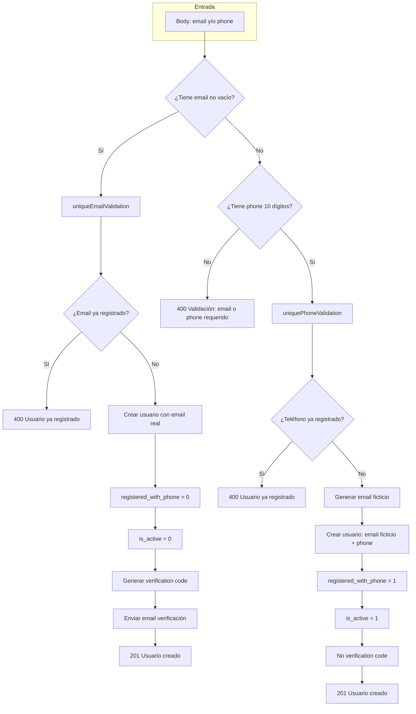

# Registro e identidad: email y teléfono

Reglas de negocio para registro de usuarios, inicio de sesión y edición de datos de contacto cuando el usuario puede registrarse con **email**, con **teléfono** o con **ambos**. Incluye el uso de **correo ficticio** para usuarios solo-teléfono y las restricciones de edición según el identificador con el que se registraron.

**Estado:** Implementado (users-api, multi-commons-layer, multi-mysql-layer).  
**Migración:** `052_registered_with_phone_added.sql`  
**Tabla:** `users` — columna `registered_with_phone`.

---

## 1. Resumen ejecutivo

- El sistema **siempre** guarda un **email** por usuario (real o ficticio) para no romper flujos que dependen del correo (notificaciones, pedidos, OpenPay, etc.).
- Los usuarios pueden **registrarse con email**, con **teléfono** o con **ambos**. Si se registran solo con teléfono, se genera un **correo ficticio** único y la cuenta queda **verificada de entrada** (sin flujo de verificación por email).
- El **login** acepta **email o teléfono** + contraseña.
- Las **ediciones** de email y teléfono se restringen según el identificador con el que se registraron: no se puede editar el identificador “principal”, sí el secundario.

---

## 2. Reglas de negocio

### 2.1 Registro (POST /users, POST /users/admin, POST /specialists/patient)

| Regla | Descripción |
|-------|-------------|
| **Al menos un identificador** | El usuario debe enviar **email** o **teléfono** (o ambos). No se permite registro sin ninguno de los dos. |
| **Email opcional si hay teléfono** | Si se envía teléfono válido (10 dígitos), el email es opcional. |
| **Teléfono opcional si hay email** | Si se envía email válido, el teléfono es opcional. |
| **Unicidad** | Si se envía email, debe ser único en el sistema. Si se registra **solo con teléfono**, el teléfono debe ser único. |
| **Registro solo con teléfono** | Si no se envía email (o viene vacío) y sí teléfono: se genera un **correo ficticio** `{phone}-{sufijoUnico}@gmail.com`, se guarda `registered_with_phone = 1`, la cuenta queda **activa** (`is_active = 1`) y **no** se envía código de verificación por email. |
| **Registro con email** | Si se envía email: flujo actual: se crea usuario con `registered_with_phone = 0`, `is_active = 0`, se genera y envía código de verificación; el usuario debe verificar para activar. |
| **Formato teléfono** | Teléfono debe ser exactamente **10 dígitos** numéricos. |
| **Pacientes (createPatient)** | Mismas reglas: email o teléfono (al menos uno); si solo teléfono, correo ficticio y cuenta activa sin verificación. |

### 2.2 Correo ficticio

| Regla | Descripción |
|-------|-------------|
| **Formato** | `{phone}-{sufijoUnico}@gmail.com` (ej. `5512345678-a1b2c3d4@gmail.com`). |
| **Unicidad** | El sufijo es único por usuario (p. ej. 8 caracteres derivados de UUID) para evitar colisiones si se reutiliza el mismo número. |
| **Uso** | Solo para usuarios que se registraron **solo con teléfono**. El sistema sigue usando “email” en todos los flujos (notificaciones, pedidos, OpenPay, etc.); el usuario puede **cambiar después** a un email real vía PATCH. |

### 2.3 Login (POST /users/login)

| Regla | Descripción |
|-------|-------------|
| **Identificador** | El cliente envía un único identificador en el campo `email`: puede ser un **email válido** o un **teléfono de 10 dígitos**. |
| **Contraseña** | Siempre obligatoria (email/teléfono + contraseña). |
| **Búsqueda** | Si el valor son 10 dígitos, se busca usuario por `phone`; en caso contrario, por `email`. |
| **Cuenta inactiva / pendiente de verificación** | Misma lógica que antes: si la cuenta no está activa y tiene código de verificación pendiente, se responde 428; si está inactiva y sin código, 410. Los usuarios solo-teléfono están activos desde el registro, por tanto pueden hacer login de inmediato. |

### 2.4 Edición de perfil (PATCH /users/:id)

| Regla | Descripción |
|-------|-------------|
| **Registrado con teléfono** (`registered_with_phone = 1`) | **No** puede editar el **teléfono**. **Sí** puede editar el **email** (p. ej. sustituir el ficticio por uno real). |
| **Registrado con email** (`registered_with_phone = 0`) | **No** puede editar el **email**. **Sí** puede editar el **teléfono**. |
| **Validación** | Si se intenta cambiar el identificador “bloqueado” (teléfono para quien se registró con teléfono, o email para quien se registró con email), el servidor responde 400 y no aplica el cambio. |

### 2.5 Recuperación de contraseña y verificaciones

| Regla | Descripción |
|-------|-------------|
| **Recuperación de contraseña** | Sigue siendo **por email**. Los usuarios que solo tienen correo ficticio no pueden usar “olvidé mi contraseña” hasta que editen su perfil y pongan un email real. |
| **Verificación al cambiar email** | Si un usuario registrado por teléfono pone un email real, el sistema actual no exige verificación por correo antes de guardar; puede definirse en una iteración futura. |

---

## 3. Diagrama de flujo: registro (POST /users)

---

## 4. Referencias técnicas

- **Validaciones:** `multi-commons-layer` → `src/utils/validations/users.js` (createUser, createPatient, login, updateUser).
- **Middleware:** `users-api` → `uniqueEmailValidation`, `uniquePhoneValidation`, `getUserByEmailOrPhone`.
- **Servicios:** `users-api` → `create.js` (rama phone-only, placeholder email), `update.js` (reglas de edición).
- **Queries:** `multi-mysql-layer` → `UsersQueries.getByEmail`, `UsersQueries.getByPhone`; columna `registered_with_phone` en SELECT/INSERT/UPDATE.
- **Helper:** `multi-commons-layer` → `generatePlaceholderEmail(phone)` en `src/utils/userHelpers.js`.
- **Tabla:** [users (DDL)](../../../04_SQL/tables/users.md).

---

## 5. Documentos relacionados

- [Reglas de Negocio (índice)](../reglas-de-negocio.md) — sección Gestión de Usuarios.
- [Impacto usuario sin email (06_Management)](../../06_Management/impacto-usuario-sin-email.md) — contexto de por qué el sistema sigue exigiendo “email” en BD y cómo se resolvió con correo ficticio.

---

- **Última actualización:** 2026-03-11
