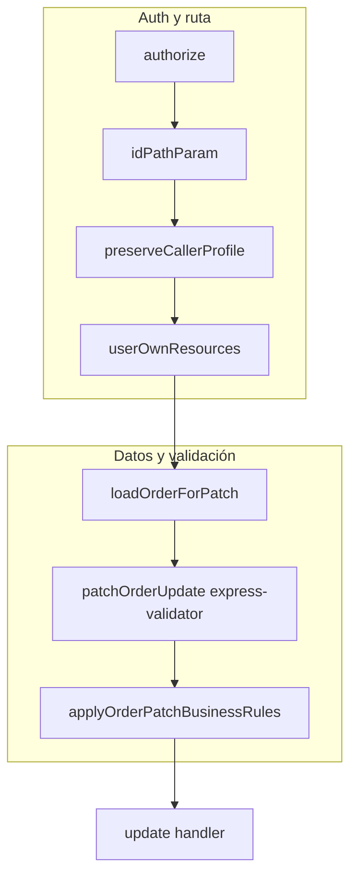
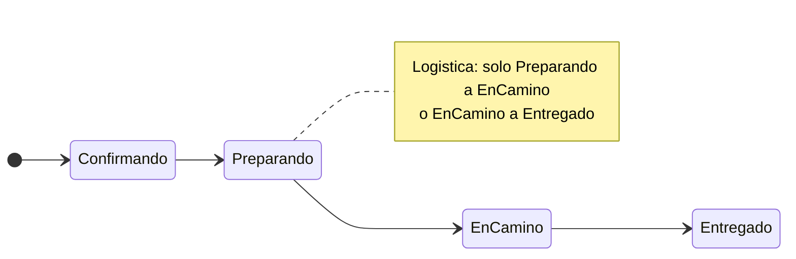
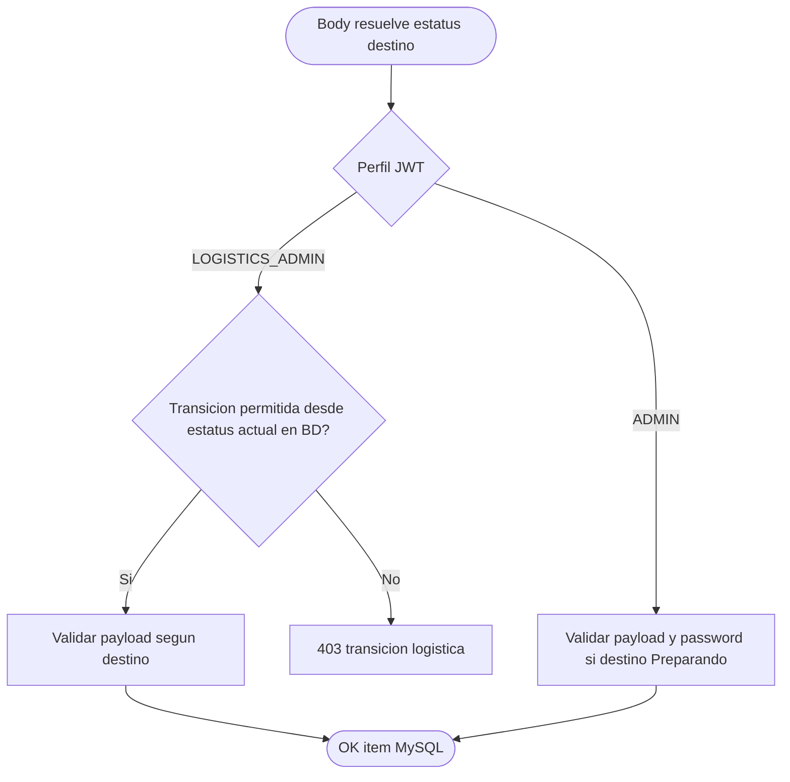

# PATCH /orders/:id — diagramas de flujo (visión técnica)

Este archivo es el **complemento visual** del documento canónico de reglas de negocio. **No duplica** las tablas de permisos ni el detalle de payloads: para eso usa siempre el enlace de abajo.

**Fuente de verdad (texto y reglas):**  
[Business Rules — patch-order-status.md](../../../../00_Overview/Business_Rules/orders/patch-order-status.md)

---

## 1. Pipeline del request (middlewares y handler)

Orden real de ejecución en `apis/orders-api` (ruta `PATCH /orders/:id`):

- **`loadOrderForPatch`:** una lectura a BD; asigna `req.patchOrder`.
- **`applyOrderPatchBusinessRules`:** usa `req.patchOrder.deliveryStatus` como estatus **actual** y el body como estatus **destino** (más header `password` si aplica).

---

## 2. Flujo ideal de estatus (referencia de negocio)

No es obligatorio para el **admin** (puede corregir saltos); sí define el comportamiento estricto del **administrador de logística**.

**Cancelado:** ver reglas y perfiles en el [documento canónico](../../../../00_Overview/Business_Rules/orders/patch-order-status.md) (sección 4).

---

## 3. Decisión simplificada: ¿qué valida la capa de negocio?

---

## 4. Dónde está el código

| Pieza | Ubicación típica |
|-------|------------------|
| Cadena de ruta | `apis/orders-api/src/routes/router.js` |
| Carga de orden | `apis/orders-api/src/middlewares/loadOrderForPatch.js` |
| Reglas de negocio | `apis/orders-api/src/services/orderPatchBusinessRules.js` |
| Validación express-validator | `multi-commons-layer` → `validations/orders.js` → `patchOrderUpdate` |
| Persistencia y notificaciones | `apis/orders-api/src/services/update.js` |

---

## 5. Mantenimiento de esta guía

- Si cambian **reglas de negocio**, edita primero **[patch-order-status.md](../../../../00_Overview/Business_Rules/orders/patch-order-status.md)** y luego ajusta **solo los diagramas** de este archivo si el flujo visual cambia.
- Evita copiar tablas de estatus aquí: un solo lugar reduce desalineación.

---

- **Última actualización:** 2026-04-15
